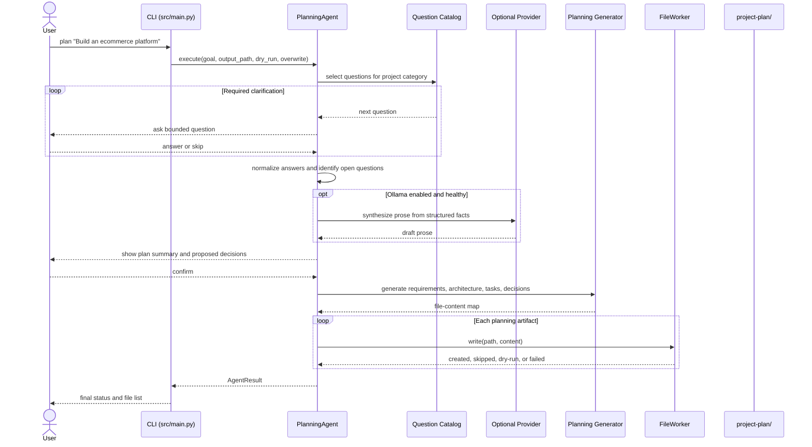
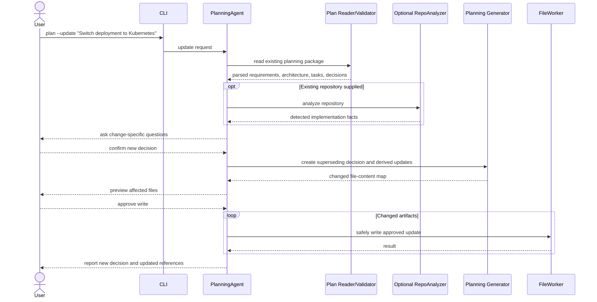
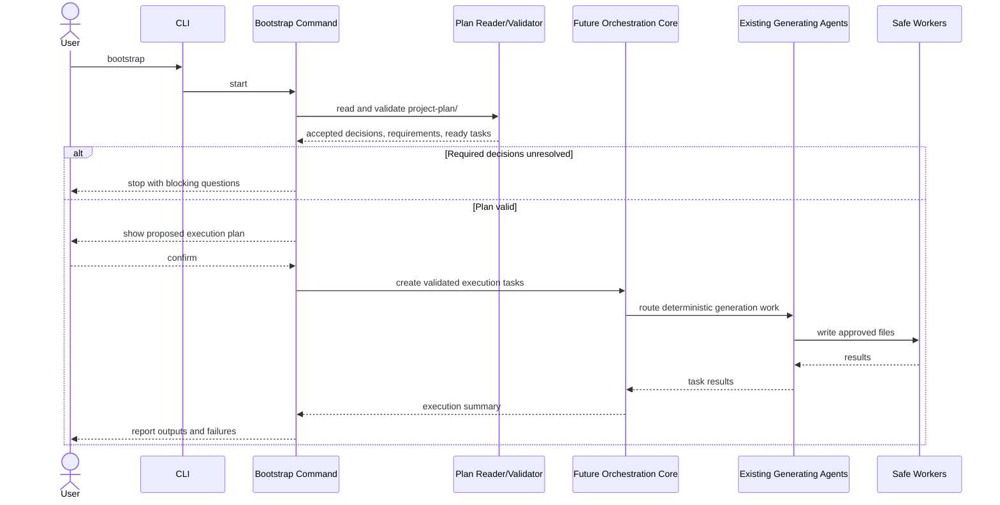

# PlanningAgent Design

## Document Status

- **Status:** Proposed
- **Project stage:** Early V1
- **Design scope:** PlanningAgent and its persistent planning artifacts
- **Implementation status:** Not implemented
- **Primary constraint:** Additive design that preserves all existing commands and the current `CLI → Agent → Analyzer → Generator → Worker` execution model

This document designs PlanningAgent from the current repository state described in `PROJECT-AUDIT.md`, `PROJECT-NOTES.md`, `docs/architecture.md`, and the source under `src/`.

The design deliberately does not treat the existing `AgentRegistry`, `TaskRouter`, or `ExecutionPlanner` as an active runtime. They are currently isolated core components, while `src/main.py` directly dispatches commands to agents. PlanningAgent V1 should follow the working runtime pattern and must not force a repository-wide orchestration rewrite.

# Section 1 — What PlanningAgent Is

## Definition

PlanningAgent is an interactive project-discovery and planning agent that converts an incomplete project idea into a small, persistent, human-readable planning package.

Example input:

`sohail-agent plan "Build an ecommerce platform"`

Example output:

```text
project-plan/
├── TASK.md
├── ARCHITECTURE.md
├── REQUIREMENTS.md
└── decisions/
    ├── 001_frontend.md
    ├── 002_backend.md
    ├── 003_database.md
    └── 004_deployment.md
```

PlanningAgent is not a code generator, repository bootstrapper, autonomous implementation agent, or replacement for the existing core `ExecutionPlanner`.

Its product responsibility is:

> Turn user intent and explicit decisions into durable planning documents that humans can review and future commands can consume.

## Why It Should Exist

The current agents begin with an existing repository and generate or inspect technical artifacts. They do not solve the earlier problem: deciding what should be built before a repository exists.

PlanningAgent fills that gap:

- captures ambiguous project intent;
- asks a bounded set of clarification questions;
- records choices and unresolved questions;
- produces requirements, architecture, and task breakdowns;
- stores decisions as files rather than temporary chat context;
- creates a stable handoff point for future commands such as `bootstrap`;
- keeps project planning local and version-controllable.

This is a natural extension of Sohail-Agent-CLI because the project is already:

- CLI-first;
- local-first;
- agent-oriented;
- focused on engineering workflows;
- built around generating reviewable files;
- explicitly opposed to opaque or uncontrolled autonomy.

## How It Improves Sohail-Agent-CLI

PlanningAgent gives the tool a useful “before code exists” workflow while preserving its practical identity.

It would improve the product in four ways:

1. **Continuity**

   User decisions survive beyond one terminal session.

2. **Traceability**

   Requirements, architecture choices, and tasks can refer to stable IDs.

3. **Human review**

   Generated plans are ordinary Markdown files that can be edited, reviewed, committed, and discussed.

4. **Future command interoperability**

   A future `bootstrap` command can read explicit decisions instead of guessing a stack from a one-line prompt.

## How It Differs From Existing Agents

| Agent | Starting point | Primary output | Executes infrastructure/code? |
|---|---|---|---|
| Repo Inspector Agent | Existing repository | Console analysis | No |
| Docker Agent | Existing repository | Docker files | Writes files |
| Kubernetes Agent | Existing repository | Kubernetes manifests | Writes files |
| CI/CD Agent | Existing repository | GitHub Actions workflows | Writes files |
| Docs Agent | Existing repository | README and deployment docs | Writes files |
| Interview Agent | Existing repository | Interview notes | Writes files |
| **PlanningAgent** | Project idea, optionally an existing repository | Requirements, architecture, tasks, decisions | Writes planning files only |

PlanningAgent differs in two important architectural ways:

- it gathers structured user input before generation;
- its output is intended to become persistent project memory, not a one-time generated artifact.

## PlanningAgent Versus `ExecutionPlanner`

The names are close but the responsibilities are different.

### PlanningAgent

- plans the user’s software project;
- asks product and architecture questions;
- creates persistent Markdown artifacts;
- operates at project-design time;
- is user-facing.

### Existing `ExecutionPlanner`

- creates in-memory `ExecutionPlan` and `PlanStep` objects;
- describes how agents could execute CLI tasks;
- operates at agent-orchestration time;
- currently has no executor and is unused by the CLI.

PlanningAgent V1 should not be built on top of `ExecutionPlanner`. Doing so would mix project planning with unfinished runtime orchestration and would expand the implementation scope unnecessarily.

# Section 2 — Current Architecture Analysis

## Current Active Architecture

The implemented runtime is:

```text
CLI command
    ↓
direct command function in src/main.py
    ↓
specific agent
    ↓
analyzer, when repository context is needed
    ↓
generator or template logic
    ↓
BaseAgent.write_file()
    ↓
FileWorker
```

PlanningAgent should initially fit this real path:

```text
CLI
    ↓
PlanningAgent
    ↓
Question/answer model
    ↓
Planning document generator
    ↓
FileWorker
```

For planning an existing repository, `RepoAnalyzer` may provide optional context:

```text
CLI
    ↓
PlanningAgent
    ├── user goal and answers
    └── optional RepoAnalyzer facts
            ↓
Planning document generator
            ↓
FileWorker
```

## BaseAgent

### Reusable

PlanningAgent can reuse:

- agent identity through `name` and `description`;
- `dry_run` and `verbose` state;
- Rich-based `info`, `success`, `warning`, and `error` output;
- `write_file()` as the route to `FileWorker`;
- `AgentResult` as the public agent result type, after baseline result semantics are corrected.

### Necessary Caution

The current `BaseAgent.write_file()` interface returns a tuple and existing agents often report success after failed or skipped writes. PlanningAgent must not copy that behavior.

Before implementation, the project should define truthful output semantics:

- created;
- updated;
- skipped because a file exists;
- dry-run previewed;
- failed.

PlanningAgent creates persistent memory. Misreporting a skipped or failed write would be especially harmful because a later command could assume the plan exists when it does not.

### Recommendation

Keep `BaseAgent` unchanged for the design phase. PlanningAgent should conform to it in V1. Any improvement to result semantics should be a general baseline hardening change applied consistently across all agents, not a PlanningAgent-only workaround.

## RepoAnalyzer

### Reusable

`RepoAnalyzer` can be useful when the user runs planning against an existing repository. It can supply:

- repository name;
- detected primary and secondary stack;
- entry points;
- key dependencies;
- project structure summary;
- presence of Docker, CI/CD, Kubernetes, tests, and documentation.

### Not Required for Greenfield V1

For `plan "Build an ecommerce platform"`, there may be no repository to analyze. PlanningAgent must work from the goal and answers alone.

### Reliability Boundary

RepoAnalyzer output is heuristic and should be treated as observed context, not an accepted design decision.

Planning documents must distinguish:

- **Detected fact:** “A `package.json` containing React dependencies was found.”
- **User decision:** “Next.js will be used for the frontend.”
- **Agent suggestion:** “Next.js may simplify server rendering.”
- **Unresolved question:** “Hosting platform has not been selected.”

PlanningAgent must never silently convert analyzer confidence into an accepted architecture choice.

### Recommendation

- V1: no dependency on RepoAnalyzer for greenfield planning.
- V2: optional repository-aware mode.
- Future: reconcile plan decisions against repository reality and report drift.

## Router

`TaskRouter` currently routes `Task` metadata to `AgentInfo` metadata. It does not hold or invoke live agent instances, and the CLI does not use it.

### V1 Position

Leave it unchanged and unused by PlanningAgent.

The `plan` command should be dispatched directly from `src/main.py`, matching every current command. This minimizes risk and keeps PlanningAgent independent from unfinished orchestration.

### Later Potential

After the router is tested and connected to actual agent execution, PlanningAgent could advertise a project-planning capability and be routed like other agents.

That integration is V2 or later, not a V1 prerequisite.

## Planner

The existing `ExecutionPlanner` produces runtime steps such as repository analysis followed by Docker generation. It does not generate product requirements or architecture decisions.

### V1 Position

Do not modify it for PlanningAgent V1.

Do not add project tasks from `TASK.md` directly to `PlanStep`. The concepts differ:

- `TASK.md` tasks are user-project work items that may take days or weeks.
- `PlanStep` values are intended to be immediate agent execution steps.

### Later Potential

A future bootstrap workflow could translate eligible `TASK.md` items into runtime tasks, but that must be an explicit adapter with validation. The Markdown task model should not be forced into the current `PlanStep` model.

## Registry

`AgentRegistry` stores `AgentInfo` and capability metadata but is not initialized with current agents.

### V1 Position

Leave it unchanged.

PlanningAgent should not be the first agent registered while every existing agent remains directly dispatched. That would create two inconsistent execution models.

### Later Potential

After core integration is deliberately completed, add a project-planning capability and register PlanningAgent alongside all existing agents.

## Providers

### Reusable

`BaseProvider`, `OllamaProvider`, `GenerationRequest`, and `MockProvider` provide a reasonable starting point for optional language synthesis.

Suitable PlanningAgent provider uses include:

- rewriting structured answers into clear prose;
- summarizing the project goal;
- explaining accepted architecture decisions;
- improving task descriptions;
- suggesting alternatives for the user to choose from.

### Provider Boundary

Providers must not be authoritative for:

- selecting the final stack;
- accepting a decision without user confirmation;
- inventing requirements;
- resolving conflicts silently;
- marking tasks complete;
- executing shell commands;
- creating code or infrastructure in the planning command.

The structured answers and accepted decision records are the source of truth. AI-generated prose is a presentation layer.

### V1 Recommendation

PlanningAgent V1 should work without Ollama.

If Ollama is included in the first implementation, it must be optional and must have deterministic fallback behavior. `MockProvider` should be used in tests through provider injection rather than direct construction of `OllamaProvider`.

## Workers

### FileWorker

PlanningAgent should use `FileWorker` through the existing `BaseAgent.write_file()` path.

The planning directory should be the only write target. No file outside the selected output root should be touched.

Required behaviors:

- no overwrite by default;
- dry-run lists every planned file;
- partial failures produce a failed or partial result, never unconditional success;
- directory creation is performed through the file-writing path;
- future update operations preserve decision history.

The current `base_path` behavior is not a reliable containment boundary. Path confinement should be hardened before PlanningAgent accepts user-controlled output paths.

### ShellWorker

PlanningAgent must not use `ShellWorker`.

Planning is a document-generation workflow. It does not need to:

- install dependencies;
- initialize Git;
- create application source;
- run package managers;
- execute Docker;
- invoke Kubernetes;
- inspect the system through shell commands.

Avoiding shell execution keeps PlanningAgent safely bounded and prevents “planning” from becoming hidden implementation.

## Existing Components That Should Remain Unchanged

PlanningAgent V1 should not require changes to the behavior of:

- Docker Agent;
- Kubernetes Agent;
- CI/CD Agent;
- Docs Agent;
- Interview Agent;
- existing analyzers;
- `TaskRouter`;
- `ExecutionPlanner`;
- `AgentRegistry`;
- `ShellWorker`;
- existing generator output formats.

Only additive integration should be necessary after baseline hardening:

- a new command;
- a new agent;
- planning-specific data models;
- a planning document generator;
- exports and tests;
- documentation.

# Section 3 — PlanningAgent Responsibilities

## Responsibility Principles

PlanningAgent should:

- ask before assuming;
- record unknowns rather than fabricate answers;
- preserve the user’s wording where important;
- separate facts, decisions, suggestions, and unresolved questions;
- produce deterministic structure;
- remain useful without an AI provider;
- stop at planning artifacts.

PlanningAgent should not:

- write application code;
- generate Docker/Kubernetes/CI files;
- execute shell commands;
- initialize repositories;
- install packages;
- choose technologies without confirmation;
- claim architectural certainty when inputs are incomplete;
- create an autonomous agent chain.

## V1 Responsibilities

V1 should be intentionally small.

### 1. Project Discovery

Capture:

- project name;
- one-sentence goal;
- target users;
- primary problem;
- first-release scope;
- explicit out-of-scope items.

### 2. Bounded Clarification Questions

Ask a predictable set of questions based on the project category.

For a web application, the first question set may cover:

- frontend approach;
- backend approach;
- database;
- authentication;
- deployment target;
- Docker requirement;
- Kubernetes requirement;
- initial scale or traffic expectation.

V1 should ask no more than approximately 5–10 required questions in one session. Optional questions can be skipped and recorded as unresolved.

### 3. Requirements Gathering

Convert answers into:

- functional requirements;
- non-functional requirements;
- constraints;
- assumptions;
- out-of-scope statements;
- open questions.

### 4. Architecture Planning

Create a high-level architecture consistent with accepted decisions.

V1 architecture should remain conceptual:

- components;
- responsibilities;
- data flow;
- external systems;
- deployment direction;
- security considerations;
- unresolved architecture questions.

It should not invent low-level code structure or exact cloud resources unless the user explicitly decided them.

### 5. Task Breakdown

Produce an ordered, traceable implementation backlog.

Tasks should:

- have stable IDs;
- have statuses;
- have priorities;
- declare dependencies;
- link to requirements and decisions;
- describe completion criteria;
- avoid code-level micromanagement.

### 6. Decision Tracking

Create one decision record per confirmed, consequential choice.

Examples:

- frontend framework;
- backend framework;
- database;
- authentication model;
- deployment model.

### 7. Safe File Generation

Write only:

- `project-plan/TASK.md`;
- `project-plan/ARCHITECTURE.md`;
- `project-plan/REQUIREMENTS.md`;
- accepted/proposed records under `project-plan/decisions/`.

## V2 Responsibilities

V2 may add controlled evolution of existing plans.

### 1. Resume and Update

- read an existing `project-plan/`;
- ask only questions affected by the requested change;
- update derived documents;
- preserve accepted decision history;
- create superseding decision records instead of rewriting history.

### 2. Existing Repository Context

- use `RepoAnalyzer` to compare implementation with the plan;
- label detected facts separately from planned decisions;
- report drift such as “Plan says PostgreSQL; repository contains MongoDB configuration.”

### 3. Optional Ollama Synthesis

- improve prose while preserving structured facts;
- summarize trade-offs;
- suggest candidate alternatives;
- generate draft rationale for explicit user approval.

### 4. Plan Validation

Detect:

- missing required decisions;
- circular task dependencies;
- task references to missing requirements;
- architecture choices without decision records;
- conflicting requirements;
- stale or superseded decisions still referenced.

### 5. Controlled Change History

Add a small change log or metadata field showing when planning files were last regenerated and which decision caused the change.

## Future Vision

Future capabilities should remain downstream consumers of the planning package.

### Future `bootstrap`

`bootstrap` could:

- read accepted decisions;
- validate required fields;
- show a proposed scaffold plan;
- require confirmation;
- invoke deterministic generators;
- write source or infrastructure only through safe workers.

### Future Planning Drift

An existing repository could be checked against:

- requirements;
- accepted decisions;
- planned components;
- planned deployment model.

### Future Multi-Agent Integration

After the core registry/router/planner has a tested executor:

- PlanningAgent can be registered;
- bootstrap steps can be routed to appropriate agents;
- plan artifacts can become explicit inputs to agent tasks;
- results can update task status only after user-approved execution.

### Explicitly Excluded Future Direction

The future vision does not require:

- autonomous swarms;
- self-modifying plans;
- hidden vector memory;
- background implementation;
- cloud dashboards;
- planning agents recursively creating other agents;
- automatic production deployment.

# Section 4 — Folder Structure

## Proposed Structure

```text
project-plan/
├── TASK.md
├── ARCHITECTURE.md
├── REQUIREMENTS.md
└── decisions/
    ├── 001_frontend.md
    ├── 002_backend.md
    ├── 003_database.md
    ├── 004_authentication.md
    └── 005_deployment.md
```

V1 should not add caches, databases, hidden state, generated JSON mirrors, vector stores, or session transcripts.

## `TASK.md`

### Purpose

The implementation backlog and current execution state.

### Owns

- task IDs;
- task descriptions;
- status;
- priority;
- dependencies;
- owner;
- linked requirements;
- linked decisions;
- acceptance criteria;
- notes.

### Does Not Own

- architecture rationale;
- complete requirement definitions;
- final technical decisions.

Those belong in `ARCHITECTURE.md`, `REQUIREMENTS.md`, and `decisions/`.

## `ARCHITECTURE.md`

### Purpose

The current high-level technical design.

### Owns

- system context;
- component boundaries;
- major data flows;
- deployment view;
- security and reliability direction;
- architecture assumptions;
- links to accepted decisions.

### Does Not Own

- decision history;
- detailed implementation backlog;
- product acceptance criteria.

## `REQUIREMENTS.md`

### Purpose

The scope contract for what the project should do and the qualities it must have.

### Owns

- functional requirements;
- non-functional requirements;
- constraints;
- assumptions;
- out-of-scope items;
- open questions;
- acceptance criteria.

### Does Not Own

- technology rationale;
- task status;
- implementation details.

## `decisions/`

### Purpose

Append-oriented, durable architecture and product decision memory.

### Owns

- decision context;
- selected option;
- rationale;
- alternatives;
- consequences;
- status and supersession.

## Source-of-Truth Precedence

When documents conflict, use this order:

1. accepted decision records for explicit choices;
2. `REQUIREMENTS.md` for agreed scope and constraints;
3. `ARCHITECTURE.md` for the current derived system design;
4. `TASK.md` for work sequencing.

If an accepted decision changes, the correct lifecycle is:

1. create a new decision record;
2. mark the old decision as superseded;
3. update requirements if scope changed;
4. update architecture;
5. update affected tasks.

## Ownership Model

### User

The user owns final decisions, scope, priorities, and acceptance.

### PlanningAgent

PlanningAgent owns:

- asking questions;
- creating structured drafts;
- maintaining cross-references;
- identifying conflicts and unknowns;
- writing files after confirmation.

PlanningAgent does not own product authority.

### Future Bootstrap Command

Bootstrap owns consumption of accepted planning artifacts. It must not rewrite decisions to make execution easier.

## Update Lifecycle

### Initial Creation

- planning directory does not exist;
- PlanningAgent asks questions;
- user confirms a summary;
- all artifacts are generated as one logical operation;
- partial write failure is reported clearly.

### Human Editing

Files remain ordinary Markdown and may be edited manually. Stable IDs and headings should make manual edits safe.

### V2 Update

- existing files are parsed;
- the requested change is identified;
- affected decisions are proposed;
- user confirms;
- new decision records are appended;
- derived documents are updated;
- unrelated content is preserved.

### Deletion

PlanningAgent should not automatically delete accepted decision records. Obsolete decisions are marked superseded or rejected.

# Section 5 — `TASK.md` Format

## Design Goals

`TASK.md` must be:

- readable in a terminal or GitHub;
- manually editable;
- stable enough for future parsing;
- traceable to requirements and decisions;
- simple enough to avoid becoming a project-management product.

## Recommended Structure

```markdown
---
planning_schema: 1
project: shopfront
document: tasks
status: active
updated: 2026-06-24
---

# Task Plan

## Status Definitions

- `proposed`
- `ready`
- `in_progress`
- `blocked`
- `done`
- `cancelled`

## Priority Definitions

- `P0` — required for the first usable release
- `P1` — important after the core path works
- `P2` — valuable but deferrable
- `P3` — optional

## Task Summary

| ID | Task | Status | Priority | Depends On | Owner |
|---|---|---|---|---|---|
| T-001 | Establish application skeleton | ready | P0 | — | unassigned |
| T-002 | Implement product catalog | proposed | P0 | T-001 | backend |
| T-003 | Implement storefront | proposed | P0 | T-001, T-002 | frontend |

## T-001 — Establish Application Skeleton

- **Status:** ready
- **Priority:** P0
- **Owner:** unassigned
- **Dependencies:** none
- **Requirements:** FR-001, NFR-002
- **Decisions:** DEC-001, DEC-002

### Objective

Create the initial frontend and backend application boundaries defined in the architecture.

### Acceptance Criteria

- frontend and backend can run independently;
- local configuration is documented;
- no production deployment is included in this task.

### Notes

- keep deployment work separate in T-008;
- authentication is not part of this task.
```

## Required Fields

Every task must contain:

- **ID:** stable `T-NNN` identifier;
- **Title:** short action-oriented description;
- **Status:** one of the defined states;
- **Priority:** `P0`–`P3`;
- **Owner:** a person, role, team, `unassigned`, or `user`;
- **Dependencies:** task IDs or `none`;
- **Requirements:** linked requirement IDs;
- **Decisions:** linked decision IDs when relevant;
- **Objective:** outcome, not implementation trivia;
- **Acceptance Criteria:** evidence that the task is complete;
- **Notes:** risks, exclusions, or useful context.

## Status Lifecycle

```text
proposed → ready → in_progress → done
                   ↘ blocked ↗

proposed/ready/in_progress → cancelled
```

PlanningAgent V1 should create tasks primarily as `proposed` or `ready`.

PlanningAgent must not mark implementation tasks `done`. Only a human or a future verified execution workflow should do that.

## Dependency Rules

- dependencies use task IDs only;
- unknown dependencies are not allowed;
- circular dependencies are invalid;
- a task should not be `ready` while a required dependency is incomplete;
- tasks may refer to multiple requirements and decisions.

## Realistic Example

```markdown
## T-006 — Implement Checkout

- **Status:** proposed
- **Priority:** P0
- **Owner:** backend
- **Dependencies:** T-002, T-004, T-005
- **Requirements:** FR-008, FR-009, NFR-004
- **Decisions:** DEC-003, DEC-004

### Objective

Allow an authenticated customer to create an order from the current cart using the selected payment-provider integration.

### Acceptance Criteria

- stock is validated before order creation;
- payment success creates one confirmed order;
- payment failure does not confirm the order;
- duplicate payment callbacks are handled idempotently;
- secrets are not stored in source control.

### Notes

- refunds are outside the first release;
- guest checkout remains unresolved in OQ-002.
```

# Section 6 — Decision Memory System

## Goal

The `decisions/` directory is the durable memory of consequential choices.

It should answer:

- what was decided;
- why it was decided;
- what alternatives were considered;
- what consequences were accepted;
- whether the decision is still current.

The design should follow a lightweight Architecture Decision Record pattern without requiring formal ADR tooling.

## Naming Convention

```text
NNN_short_slug.md
```

Examples:

- `001_frontend.md`
- `002_backend.md`
- `003_database.md`
- `004_authentication.md`
- `005_deployment.md`

Rules:

- three-digit, monotonically increasing number;
- lowercase slug;
- words separated by underscores;
- never renumber existing decisions;
- filename number is creation order, not priority;
- one primary decision topic per file.

## Decision Identifier

Inside the document, use:

`DEC-NNN`

Example:

- filename: `003_database.md`
- identifier: `DEC-003`

## Recommended Format

```markdown
---
planning_schema: 1
id: DEC-003
title: Select the primary database
status: accepted
date: 2026-06-24
supersedes: null
superseded_by: null
---

# DEC-003 — Select the Primary Database

## Context

The first release requires customer accounts, products, inventory, carts, orders, and payment records. These records have transactional relationships and must remain consistent during checkout.

## Decision

Use PostgreSQL as the primary transactional database.

## Rationale

- the domain is relational;
- checkout requires transactions;
- uniqueness and foreign-key constraints are valuable;
- PostgreSQL has mature operational tooling.

## Alternatives Considered

### MongoDB

Rejected for the primary store because the core order and payment model benefits from relational constraints and transactions.

### SQLite

Suitable for local prototypes but not selected as the production database.

## Consequences

### Positive

- strong transactional guarantees;
- clear relational data model;
- broad hosting support.

### Negative

- schema migrations must be managed;
- production backups and connection limits must be planned.

## Related Requirements

- FR-003
- FR-008
- NFR-004

## Related Tasks

- T-002
- T-006

## Open Questions

- managed provider is not selected;
- retention period is not defined.
```

## Decision Statuses

- **proposed:** draft awaiting explicit confirmation;
- **accepted:** current authoritative decision;
- **rejected:** considered and not selected;
- **superseded:** replaced by a later decision;
- **deprecated:** still present but planned for removal.

## Lifecycle

### Creation

PlanningAgent drafts a proposed decision from the conversation.

### Confirmation

The user confirms or changes the decision. Only then may it become `accepted`.

### Change

Accepted decisions are not rewritten to hide history.

If the database changes from PostgreSQL to MongoDB:

1. create a new decision record;
2. set the old record to `superseded`;
3. set `superseded_by` on the old record;
4. set `supersedes` on the new record;
5. update architecture, requirements, and affected tasks.

### Rejection

A proposed option may be kept as `rejected` when its rationale is useful. Trivial unselected options do not need separate files; they can remain under “Alternatives Considered.”

## Memory Rules

- decision files are the authoritative record for accepted technical choices;
- model-generated suggestions are not decisions;
- user answers must be confirmed before acceptance;
- unresolved topics remain open questions, not invented defaults;
- sensitive values, secrets, passwords, and tokens must never be stored;
- decision history is append-oriented;
- decision documents should remain concise.

# Section 7 — `ARCHITECTURE.md` Design

## Purpose

`ARCHITECTURE.md` is the current high-level design derived from accepted decisions and requirements.

It explains the intended system without requiring a reader to reconstruct it from every decision record.

## Recommended Sections

1. **Document Metadata**
   - schema version;
   - project;
   - status;
   - last updated;
   - referenced decision IDs.

2. **Architecture Summary**
   - one-paragraph system description.

3. **Goals and Non-Goals**
   - what the design optimizes for;
   - what it intentionally does not cover.

4. **System Context**
   - users;
   - external services;
   - system boundary.

5. **Major Components**
   - frontend;
   - backend/API;
   - database;
   - background workers, if accepted;
   - external integrations.

6. **Component Responsibilities**
   - one clear responsibility list per component.

7. **Data Flow**
   - important request and event paths;
   - no invented low-level implementation details.

8. **Data Model Overview**
   - major entities and relationships;
   - link to database decision.

9. **Authentication and Authorization**
   - selected model;
   - trust boundaries;
   - unresolved security decisions.

10. **Deployment View**
    - local development;
    - intended production shape;
    - Docker/Kubernetes only when explicitly selected.

11. **Reliability and Observability**
    - error handling direction;
    - logging;
    - monitoring;
    - backup/recovery expectations.

12. **Security and Privacy**
    - sensitive data;
    - secrets;
    - data retention;
    - known constraints.

13. **Architecture Decisions**
    - index of accepted decision records.

14. **Assumptions and Open Questions**
    - clearly unresolved topics.

## Example Outline

```markdown
# Architecture

## Summary

Shopfront is a web application with a Next.js frontend, a Python API, and PostgreSQL as the transactional data store.

## Major Components

### Web Frontend

- renders catalog, cart, checkout, and account screens;
- communicates with the backend API;
- does not access the database directly.

### Backend API

- owns business rules;
- validates authentication and authorization;
- coordinates inventory, orders, and payments.

### PostgreSQL

- stores users, products, inventory, carts, orders, and payment references;
- is the system of record for transactional state.

## Decision Index

- [DEC-001 — Frontend](decisions/001_frontend.md)
- [DEC-002 — Backend](decisions/002_backend.md)
- [DEC-003 — Database](decisions/003_database.md)
```

## Future Usage

`ARCHITECTURE.md` can later be consumed by:

- `bootstrap` to understand component boundaries;
- Docs Agent to produce accurate documentation;
- Interview Agent to explain architecture without inventing claims;
- Repo Inspector to compare planned and detected architecture;
- human reviewers during design and implementation.

Future commands must treat it as a current view, not the full decision history.

# Section 8 — `REQUIREMENTS.md` Design

## Purpose

`REQUIREMENTS.md` defines what the project must accomplish, how well it must operate, and what constraints apply.

It is the scope contract between the idea and the implementation plan.

## Requirement Categories

### Functional Requirements

Functional requirements describe user-visible or system behavior.

Identifier:

`FR-NNN`

Examples:

- `FR-001`: A visitor can browse active products.
- `FR-002`: A customer can add products to a cart.
- `FR-003`: A customer can create an account.
- `FR-004`: An authenticated customer can place an order.
- `FR-005`: An administrator can update product inventory.

### Non-Functional Requirements

Non-functional requirements describe quality attributes.

Identifier:

`NFR-NNN`

Examples:

- `NFR-001`: The main catalog page should meet the agreed response-time target.
- `NFR-002`: Secrets must be provided through runtime configuration.
- `NFR-003`: Checkout operations must be idempotent.
- `NFR-004`: Order creation must preserve transactional consistency.
- `NFR-005`: Production errors must be logged without exposing sensitive data.

### Constraints

Constraints describe fixed boundaries or mandated choices.

Identifier:

`CON-NNN`

Examples:

- `CON-001`: The first release must run locally with Docker Compose.
- `CON-002`: The project must use only locally hosted AI during planning.
- `CON-003`: The initial team has one frontend and one backend developer.
- `CON-004`: Kubernetes is outside the first release.

## Recommended Structure

```markdown
---
planning_schema: 1
project: shopfront
document: requirements
status: draft
updated: 2026-06-24
---

# Requirements

## Project Goal

Build a small ecommerce platform for a single merchant.

## Target Users

- shoppers;
- authenticated customers;
- store administrators.

## Functional Requirements

### FR-001 — Browse Products

- **Priority:** must
- **Status:** accepted
- **Source:** user
- **Acceptance:** Visitors can view active products with name, image, price, and stock state.

### FR-002 — Manage Cart

- **Priority:** must
- **Status:** accepted
- **Source:** user
- **Acceptance:** A visitor can add, update, and remove cart items.

## Non-Functional Requirements

### NFR-001 — Secret Management

- **Priority:** must
- **Status:** accepted
- **Acceptance:** No production secret is committed to source control.

## Constraints

### CON-001 — Initial Deployment

The first release will use Docker Compose and will not require Kubernetes.

## Assumptions

- one merchant owns the catalog;
- one currency is supported initially.

## Out of Scope

- marketplace sellers;
- multiple warehouses;
- native mobile applications;
- recommendation engines.

## Open Questions

- OQ-001: Is guest checkout required?
- OQ-002: Which payment provider will be used?
```

## Requirement Fields

Each requirement should include:

- stable ID;
- title;
- category;
- priority;
- status;
- source;
- requirement statement;
- acceptance criterion;
- related decision IDs, when applicable;
- notes or open questions.

## Requirement Statuses

- proposed;
- accepted;
- deferred;
- rejected;
- superseded.

## Priority Vocabulary

Use a small vocabulary:

- must;
- should;
- could;
- will_not.

This is easier to understand in requirements than reusing task priority labels.

## Constraints Versus Decisions

The distinction matters:

- “The organization mandates PostgreSQL” is a constraint.
- “PostgreSQL was selected after comparing alternatives” is a decision.

A topic may appear in both files when a decision satisfies a constraint, but the documents should link rather than duplicate full rationale.

# Section 9 — Execution Flow

## V1 User Flow

```text
User
  ↓
plan command with project goal
  ↓
PlanningAgent validates goal and output path
  ↓
PlanningAgent selects a bounded question set
  ↓
User answers or skips questions
  ↓
PlanningAgent normalizes answers
  ↓
PlanningAgent shows summary, decisions, and open questions
  ↓
User confirms
  ↓
Planning document generator creates in-memory content
  ↓
FileWorker writes project-plan files
  ↓
PlanningAgent reports created, skipped, dry-run, and failed files
```

## Initial Planning Sequence



## Important Flow Rules

### Confirmation Boundary

No decision becomes `accepted` and no file is written until the user confirms the normalized summary.

### Skip Behavior

If the user skips a required planning choice:

- the topic is recorded as an open question;
- no default is silently accepted;
- dependent tasks may be marked blocked or proposed;
- future bootstrap must refuse affected actions until resolved.

### Dry-Run Behavior

Dry-run should:

- conduct the question flow;
- produce the normalized summary;
- show target files;
- optionally show concise content summaries;
- perform no writes.

Provider/network behavior in dry-run must be explicitly documented. The safer default is deterministic generation without provider calls unless the user explicitly requested AI enhancement.

### Overwrite Behavior

For initial V1:

- existing planning files are protected by default;
- `--overwrite` may replace generated summary documents only after a clear warning;
- accepted decision records should not be silently replaced;
- if any protected decision file conflicts, the operation should stop or skip with a non-success result.

For V2 updates, a dedicated update lifecycle is preferable to broad overwrite.

## V2 Update Sequence



## Future Bootstrap Sequence



# Section 10 — Integration Strategy

## CLI Integration

### V1 Command Shape

Conceptual interface:

```text
sohail-agent plan "Build an ecommerce platform"
```

Potential bounded options:

- output root;
- project name;
- non-interactive answers file, later;
- optional Ollama use;
- dry-run;
- overwrite for initial documents only.

The command should follow the current direct dispatch model:

```text
main.py command map
    ↓
cmd_plan()
    ↓
PlanningAgent.execute()
```

Do not route only this command through `TaskRouter` while existing commands remain direct.

### Interactive Input

V1 may use ordinary terminal prompts. The question engine should be separate from the agent’s document-rendering logic so it can later support:

- interactive CLI;
- pre-supplied answers;
- tests;
- resumed sessions.

### Non-Interactive Environments

V1 should detect when required input cannot be collected. It should fail with a clear message rather than hang in CI or redirected input.

## Agent Integration

PlanningAgent should inherit from `BaseAgent` to remain consistent with existing agents.

Its conceptual internal collaborators are:

- a question catalog or discovery component;
- planning-specific data models;
- a planning document generator;
- optional `BaseProvider`;
- `FileWorker` through the base write path.

The agent should coordinate; it should not contain all Markdown templates inline. The current Interview Agent shows the maintenance cost of embedding a large template directly in an agent.

## Generator Integration

Planning documents deserve a dedicated deterministic generator.

The generator should accept structured planning data and return a file-content map, conceptually:

```text
TASK.md → content
ARCHITECTURE.md → content
REQUIREMENTS.md → content
decisions/001_frontend.md → content
...
```

The generator must not:

- ask questions;
- call providers;
- write files;
- execute commands;
- infer accepted decisions from missing data.

This preserves the existing Analyzer/Generator/Worker separation even though greenfield planning may not need an analyzer.

## Core Integration

### V1

No runtime dependency on:

- `Task`;
- `PlanStep`;
- `ExecutionPlan`;
- `AgentRegistry`;
- `TaskRouter`;
- `ExecutionPlanner`.

### V2

After core hardening:

- define a project-planning capability;
- register all agents consistently;
- route PlanningAgent through the same runtime as other agents;
- introduce an executor before claiming multi-agent orchestration.

### Naming Protection

Documentation and code should consistently use:

- **PlanningAgent** for project discovery and artifact generation;
- **ExecutionPlanner** for runtime agent-step planning.

Avoid generic references such as “the planner” where the meaning is ambiguous.

## Provider Integration

PlanningAgent should depend conceptually on `BaseProvider`, not directly on `OllamaProvider`.

Benefits:

- `MockProvider` can test AI-assisted branches;
- provider unavailability can be simulated;
- deterministic mode remains the default;
- local Ollama remains an implementation choice rather than agent logic.

Provider output must be validated against structured input before writing. At minimum:

- no new decisions;
- no removed constraints;
- no invented requirements;
- no changed IDs;
- no changed task dependencies.

## Worker Integration

PlanningAgent uses only file operations.

The output path should resolve under an explicitly selected root. Before implementation, `FileWorker` should enforce real containment when `base_path` is supplied.

The write should be treated as one logical planning package:

- generate all content in memory;
- validate cross-references;
- preview planned paths;
- write;
- report partial failure accurately.

True atomic multi-file transactions are not currently available. V1 should acknowledge this and avoid claiming atomicity.

## Future Bootstrap Integration

`bootstrap` should consume the planning package through a dedicated reader/validator, not by scraping arbitrary prose.

Bootstrap eligibility should require:

- supported `planning_schema`;
- accepted required decisions;
- no unresolved blocking questions;
- valid task and requirement references;
- no circular dependencies;
- explicit user confirmation;
- supported stack choices.

Bootstrap should read:

- `REQUIREMENTS.md` for scope and constraints;
- accepted decision records for technology choices;
- `ARCHITECTURE.md` for component boundaries;
- `TASK.md` for sequencing.

Bootstrap must not assume every task is executable by an agent. Human tasks, research tasks, and unsupported implementation work remain human-owned.

## Compatibility Strategy

PlanningAgent should be additive:

- no change to current command names;
- no change to existing output paths;
- no automatic invocation from `all`;
- no requirement that existing repositories adopt `project-plan/`;
- no automatic modification of README, Docker, Kubernetes, or CI files;
- no provider requirement;
- no core orchestration requirement.

PlanningAgent should not be added to `all` in V1. Planning a project is an interactive, intent-changing workflow and does not belong in a bulk generation command.

# Section 11 — Risks and Mitigations

## Overengineering Risk

### Risk

PlanningAgent could expand into:

- a full project-management system;
- a requirements database;
- a graph engine;
- a workflow scheduler;
- a plugin platform;
- an autonomous software factory.

### Mitigation

- use four artifact types only;
- use Markdown and stable IDs;
- keep statuses and priorities small;
- ask a bounded question set;
- exclude calendars, estimates, sprints, comments, notifications, and dashboards;
- require a concrete consumer before adding metadata.

## Memory Risk

### Risk

Persistent files can become stale, contradictory, or treated as infallible.

### Mitigation

- define source-of-truth precedence;
- record status and update date;
- use superseding decision records;
- validate links and conflicts;
- separate detected facts from decisions;
- keep open questions visible;
- never hide changes in model memory.

## AI Hallucination Risk

### Risk

Ollama may invent requirements, components, constraints, or implementation claims.

### Mitigation

- deterministic structured data is authoritative;
- AI is optional;
- use AI for prose only;
- show a confirmation summary;
- preserve unknowns;
- validate that IDs and facts did not change;
- test AI paths with `MockProvider`.

## Complexity Risk

### Risk

Interactive sessions, parsing, updates, and cross-references can create more complexity than the current codebase can support.

### Mitigation

- V1 creates new plans only;
- defer resume/update parsing to V2;
- use a fixed schema version;
- avoid integrating the unused core in V1;
- keep the first question catalog static;
- avoid generic workflow engines.

## Maintenance Risk

### Risk

Markdown templates and question sets may diverge or duplicate logic.

### Mitigation

- centralize planning models;
- centralize document rendering in one planning generator;
- give each field one owner;
- add golden-output tests;
- validate cross-document references;
- keep provider prompts outside document structure.

## File Safety Risk

### Risk

PlanningAgent may overwrite valuable human-edited project memory or write outside the intended directory.

### Mitigation

- no overwrite by default;
- harden path containment first;
- show target paths before writes;
- avoid broad overwrite for decision records;
- create new superseding records;
- report partial failures truthfully;
- never use shell commands for file generation.

## Scope Authority Risk

### Risk

The agent may appear to make product decisions on behalf of the user.

### Mitigation

- every consequential choice requires confirmation;
- suggestions remain labeled suggestions;
- unresolved choices remain open questions;
- generated documents identify sources;
- accepted decision status belongs to the user.

## Bootstrap Coupling Risk

### Risk

Designing PlanningAgent around an imagined bootstrap implementation could create speculative fields and premature abstractions.

### Mitigation

- store only information useful to humans now;
- use stable IDs and a schema version for future parsing;
- defer executable action schemas until bootstrap is designed;
- do not encode shell commands into tasks;
- keep task objectives separate from agent execution steps.

## Existing Architecture Risk

### Risk

PlanningAgent could be used to justify prematurely activating the incomplete router/planner/registry stack.

### Mitigation

- direct CLI dispatch in V1;
- no `ExecutionPlan` dependency;
- core integration only after an executor, tests, and consistent registration exist;
- document the distinction between project planning and runtime planning.

# Section 12 — Implementation Roadmap

The roadmap is intentionally gated. Phase 1 is prerequisite hardening, not PlanningAgent feature code.

## Phase 1 — Baseline Reliability Gate

Complete before PlanningAgent writes persistent memory:

1. add CLI tests for current command parsing and exit codes;
2. fix the broken `all` command and truthful error propagation;
3. fix agent result semantics for created, skipped, dry-run, and failed files;
4. add FileWorker tests for overwrite and dry-run behavior;
5. enforce real `base_path` containment or stop describing it as a restriction;
6. add provider lifecycle and fallback tests;
7. establish a clean test environment in the repository;
8. document the actual global-option placement.

Exit criteria:

- existing command tests pass;
- failed writes cannot produce a successful result;
- dry-run performs no writes;
- path containment is verified;
- PlanningAgent can rely on safe, truthful file output.

## Phase 2 — Minimal PlanningAgent V1

Build only the initial creation workflow:

1. define planning-specific structured models and schema version;
2. define a bounded deterministic question catalog;
3. define answer normalization and open-question handling;
4. create a dedicated planning document generator;
5. create PlanningAgent using BaseAgent and FileWorker;
6. add direct `plan` CLI dispatch;
7. generate the four artifact groups;
8. add confirmation before accepted decisions and writes;
9. support dry-run and default overwrite protection;
10. add unit, generator, CLI, and golden-output tests.

Exit criteria:

- works without Ollama;
- creates internally consistent planning files;
- never executes shell commands;
- does not modify existing commands;
- does not silently accept unknown choices;
- all cross-references validate.

## Phase 3 — Controlled PlanningAgent V2

Add plan evolution only after V1 is stable:

1. parse existing planning packages;
2. validate schema and references;
3. add resume/update workflows;
4. implement decision supersession;
5. preserve human-edited content where ownership permits;
6. add optional RepoAnalyzer context;
7. add drift reporting;
8. inject optional `BaseProvider`;
9. use MockProvider in tests;
10. add conflict and migration tests.

Exit criteria:

- accepted decision history is preserved;
- updates change only affected artifacts;
- detected repository facts never silently override user decisions;
- provider failure leaves a complete deterministic plan.

## Phase 4 — Future Bootstrap and Core Integration

Proceed only after the current core orchestration is made real:

1. design a plan reader/validator contract;
2. define bootstrap eligibility rules;
3. distinguish human tasks from executable agent tasks;
4. add a tested execution engine for `ExecutionPlan`;
5. register all agents consistently;
6. route all commands consistently or retain direct dispatch consistently;
7. translate approved planning inputs into deterministic agent tasks;
8. require execution preview and confirmation;
9. update task status only from verified results;
10. keep deployment and destructive actions outside automatic bootstrap.

Exit criteria:

- no special-case orchestration for PlanningAgent;
- unresolved decisions block dependent execution;
- bootstrap consumes stable plan data without inventing choices;
- failures are visible and recoverable;
- existing agents remain independently usable.

# Section 13 — Final Recommendation

## 1. Should PlanningAgent Be Built Now?

**The design should be approved now, but implementation should not begin before the Phase 1 reliability gate.**

PlanningAgent is a coherent next feature because it:

- matches the CLI-first product;
- produces reviewable files;
- uses local optional AI appropriately;
- creates a foundation for future bootstrap;
- adds depth rather than unrelated breadth.

However, persistent project memory depends on truthful writes, safe paths, reliable dry-run behavior, and tests. The current repository does not yet meet that baseline.

After Phase 1, a tightly scoped PlanningAgent V1 is reasonable. It should not wait for every Docker/Kubernetes/CI template to become production-grade, but it should wait for shared CLI, result, worker, and provider foundations to be trustworthy.

## 2. What Should Be Completed First?

Before PlanningAgent implementation:

1. CLI and worker tests;
2. truthful agent result handling;
3. `all` command repair;
4. file path containment;
5. dry-run and overwrite correctness;
6. provider injection/lifecycle basics if Ollama will be used;
7. a clear distinction between the active direct-dispatch architecture and the future core architecture.

## 3. What Should Be Postponed?

Postpone:

- plan update/resume;
- repository drift analysis;
- Ollama-generated question selection;
- router/registry/planner integration;
- automatic task-status updates;
- bootstrap;
- code generation from tasks;
- cloud-specific architecture generation;
- multiple planning schemas;
- import/export formats beyond Markdown;
- collaboration and project-management features.

## 4. What Should Never Be Added?

PlanningAgent should never become:

- an autonomous code-writing loop hidden behind `plan`;
- a shell-executing planning command;
- an agent swarm coordinator;
- a hidden vector-memory system;
- a source of unconfirmed architecture decisions;
- a secrets store;
- a cloud dashboard requirement;
- a replacement for human product ownership;
- an automatic production deployment path;
- a mechanism that marks work complete without verified evidence.

## Final Position

PlanningAgent is the right conceptual evolution for Sohail-Agent-CLI only if it remains small, explicit, local, and file-based.

The recommended V1 is:

> A deterministic interactive planning agent that asks bounded questions, records confirmed decisions, generates four kinds of Markdown planning artifacts, uses safe file writes, and stops before implementation.

That version strengthens the project’s identity without pretending the current repository is already an autonomous multi-agent platform.
